# Model comparison report

All results are on the **held-out, 100% real TEST split** - TRAIN was the retrieval-grounded-augmented + SMOTE-balanced set (see docs/AUGMENTATION.md). VAL/TEST were never augmented.

## fmcg

> **Known limitation:** Stock_On_Hand/Reorder_Level in the source FMCG data are independent random draws per invoice line (documented in docs/STATUS.md); the resulting stock_risk label carries no learnable signal beyond the base rate even after augmentation. Reported here for completeness and honesty, not as a claim of a working classifier.

Training rows before SMOTE (post-augmentation, capped at 150,000 for tractability): 150,000. Best model by test F1: **decision_tree**.

| model | precision | recall | f1 | roc-auc | pr-auc | confidence | TP | FP | TN | FN | fit(s) |
|---|---|---|---|---|---|---|---|---|---|---|---|
| baseline_majority | 0.0162 | 1.0 | 0.0319 | 0.5 | 0.0162 | 0.0 | 242 | 14710 | 0 | 0 | 0.004 |
| logistic_regression | 0.0159 | 0.6074 | 0.031 | 0.4894 | 0.0157 | 0.5649 | 147 | 9084 | 5626 | 95 | 0.848 |
| decision_tree | 0.0164 | 0.8306 | 0.0322 | 0.4872 | 0.0155 | 0.5017 | 201 | 12052 | 2658 | 41 | 1.978 |
| random_forest | 0.0161 | 0.8471 | 0.0317 | 0.4987 | 0.0159 | 0.3804 | 205 | 12501 | 2209 | 37 | 55.509 |
| hist_gradient_boosting | 0.0161 | 0.9174 | 0.0316 | 0.4978 | 0.0167 | 0.1017 | 222 | 13599 | 1111 | 20 | 7.157 |
| mlp_neural_net | 0.0195 | 0.0661 | 0.0301 | 0.5039 | 0.0168 | 0.9609 | 16 | 806 | 13904 | 226 | 48.466 |

Test-set support: 14,710 negative (OK), 242 positive (at-risk).

Interpretability method: **permutation_importance (shap not installed - see module docstring)**. Top features for decision_tree:

- `Category=Vegetables`: 0.04178
- `Brand=Amul`: 0.01339
- `Brand=Nestle`: 0.01161
- `Units`: 0.0039
- `Lead_Time_Days`: 0.00331
- `Brand=ITC`: 0.00161
- `City=Kolkata`: 0.00042
- `month`: 0.0

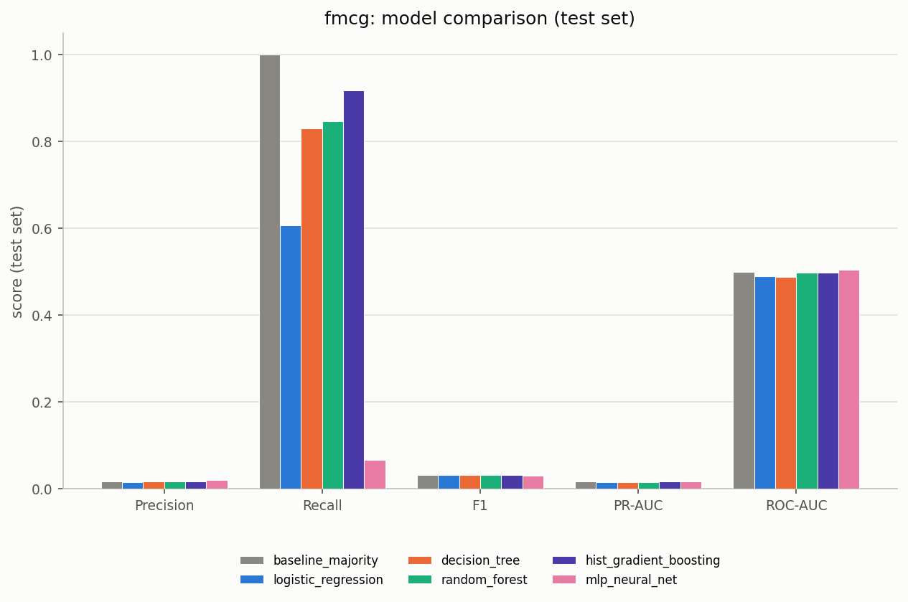
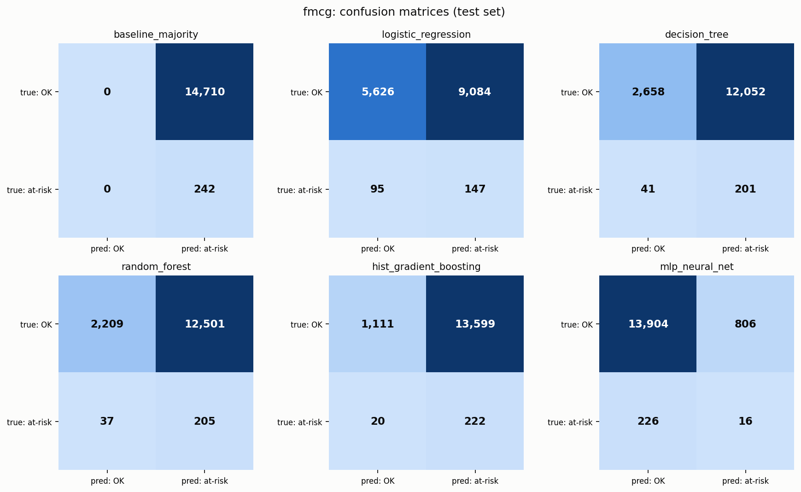
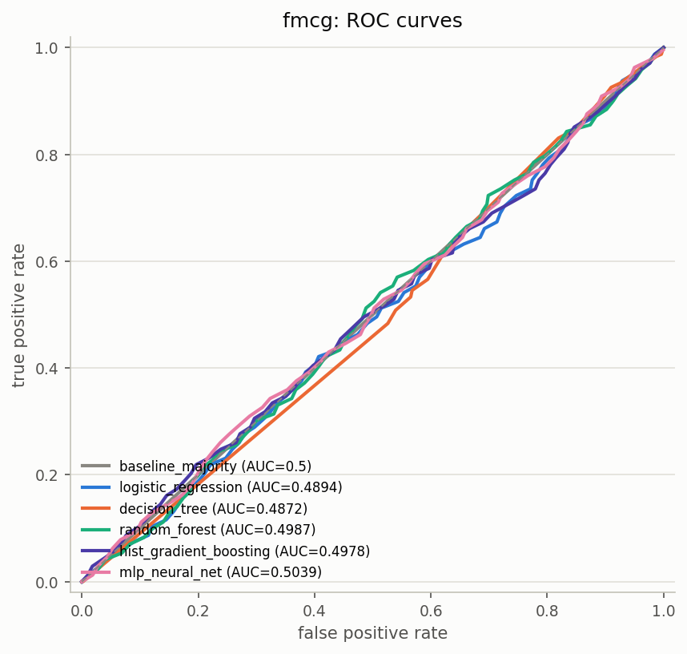
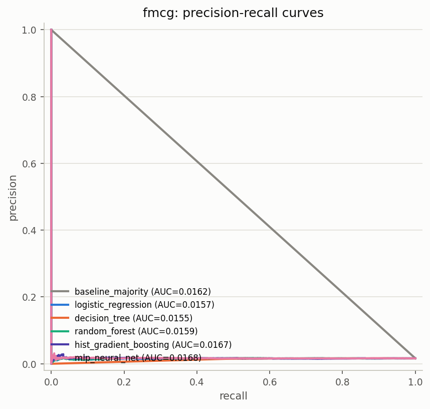
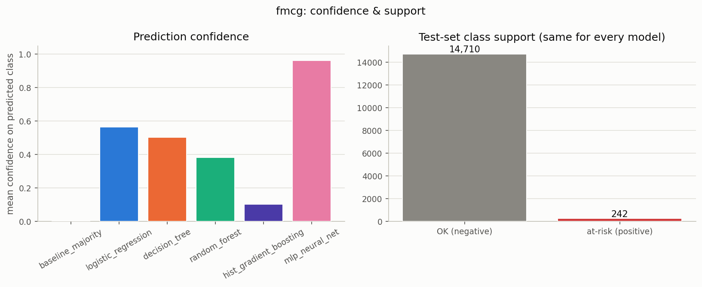
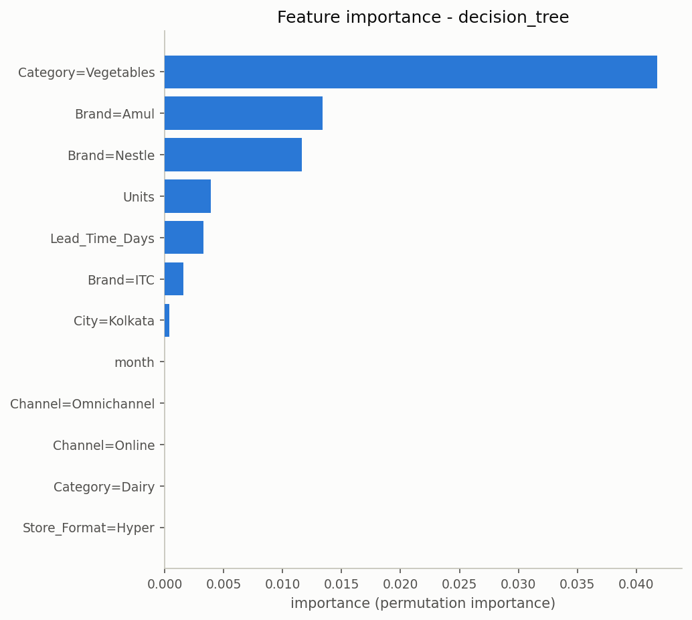
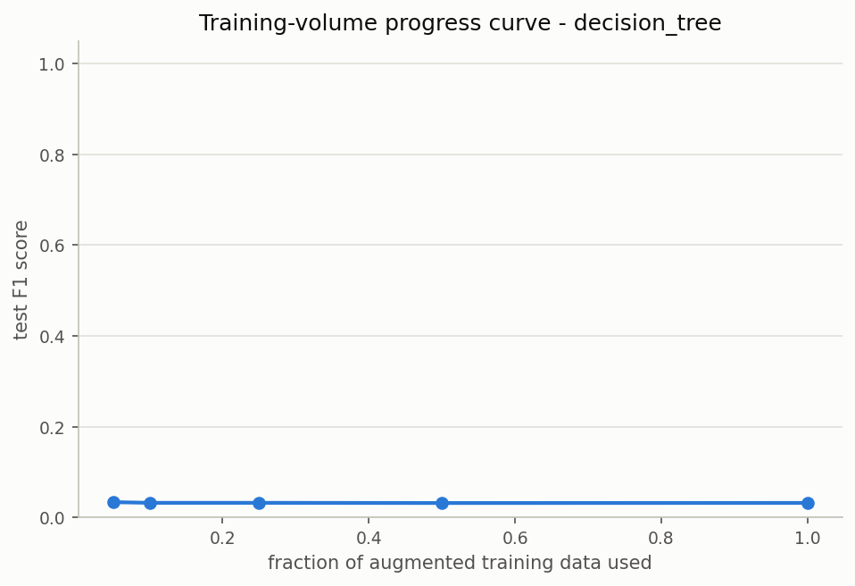

## grocery

Training rows before SMOTE (post-augmentation, capped at 20,506 for tractability): 20,506. Best model by test F1: **hist_gradient_boosting**.

| model | precision | recall | f1 | roc-auc | pr-auc | confidence | TP | FP | TN | FN | fit(s) |
|---|---|---|---|---|---|---|---|---|---|---|---|
| baseline_majority | 0.2365 | 1.0 | 0.3825 | 0.5 | 0.2365 | 0.0 | 35 | 113 | 0 | 0 | 0.001 |
| logistic_regression | 0.7576 | 0.7143 | 0.7353 | 0.9446 | 0.8769 | 0.8237 | 25 | 8 | 105 | 10 | 0.252 |
| decision_tree | 0.7209 | 0.8857 | 0.7949 | 0.957 | 0.8731 | 0.8874 | 31 | 12 | 101 | 4 | 0.176 |
| random_forest | 0.875 | 0.8 | 0.8358 | 0.9818 | 0.9418 | 0.7784 | 28 | 4 | 109 | 7 | 4.829 |
| hist_gradient_boosting | 0.9062 | 0.8286 | 0.8657 | 0.9843 | 0.9567 | 0.9278 | 29 | 3 | 110 | 6 | 1.16 |
| mlp_neural_net | 0.6136 | 0.7714 | 0.6835 | 0.8837 | 0.6822 | 0.9379 | 27 | 17 | 96 | 8 | 6.554 |

Test-set support: 113 negative (OK), 35 positive (at-risk).

Interpretability method: **permutation_importance (shap not installed - see module docstring)**. Top features for hist_gradient_boosting:

- `Lead_Time_Days`: 0.40281
- `SKU_Churn_Rate`: 0.11214
- `Avg_Daily_Sales`: 0.00907
- `Order_Frequency_per_month`: 0.00638
- `Supplier_OnTime_Pct`: 0.00594
- `Unit_Cost_USD`: 0.00572
- `Quantity_Reserved`: 0.00386
- `Returns_Qty`: 0.00243

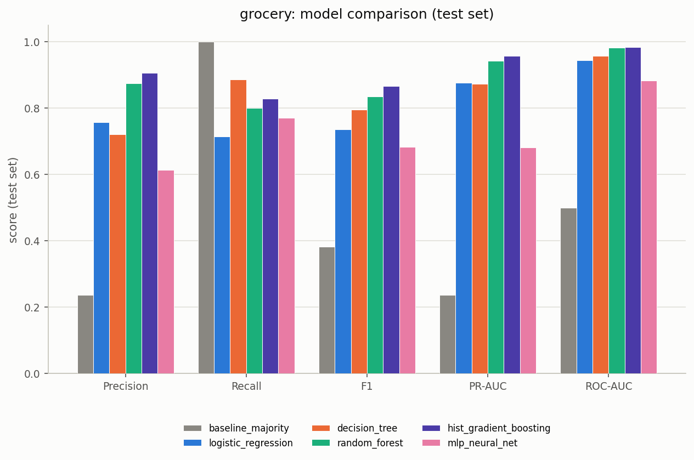
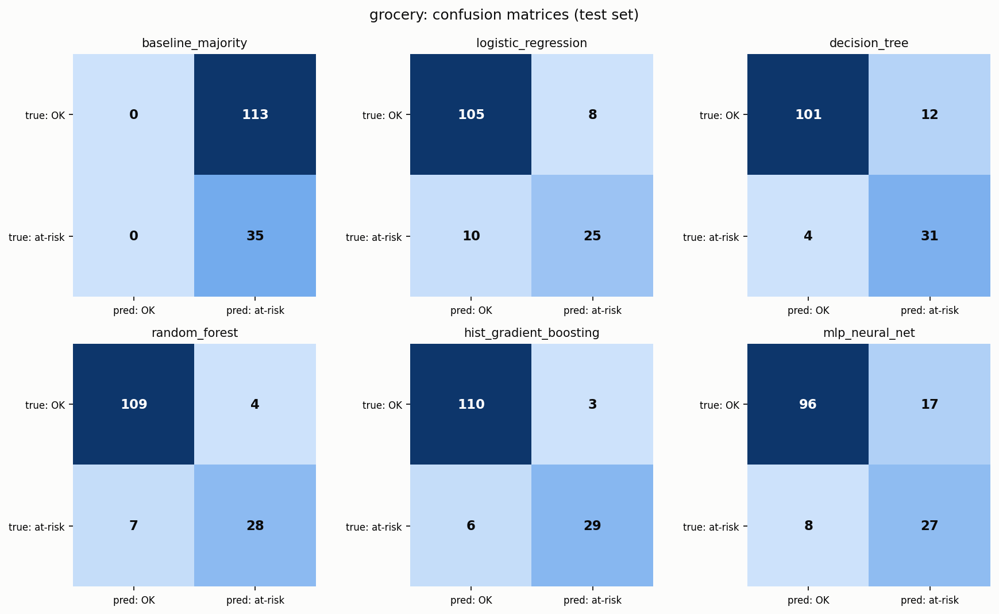
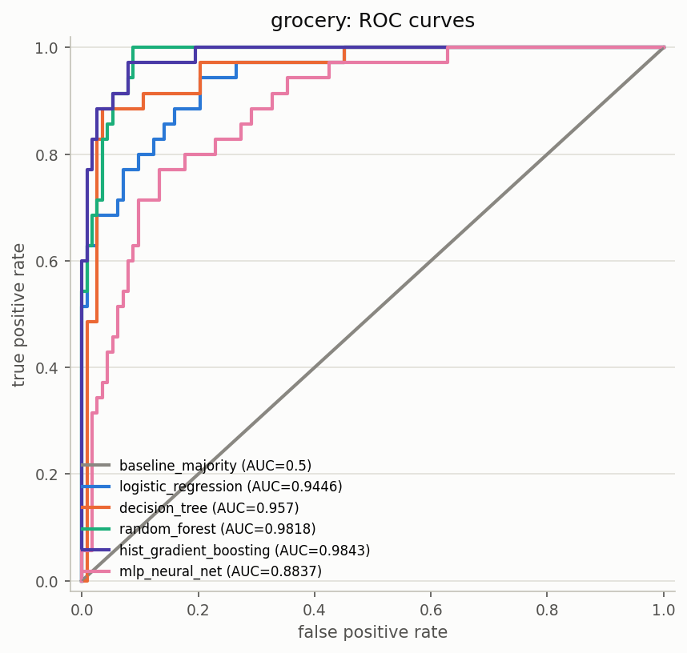
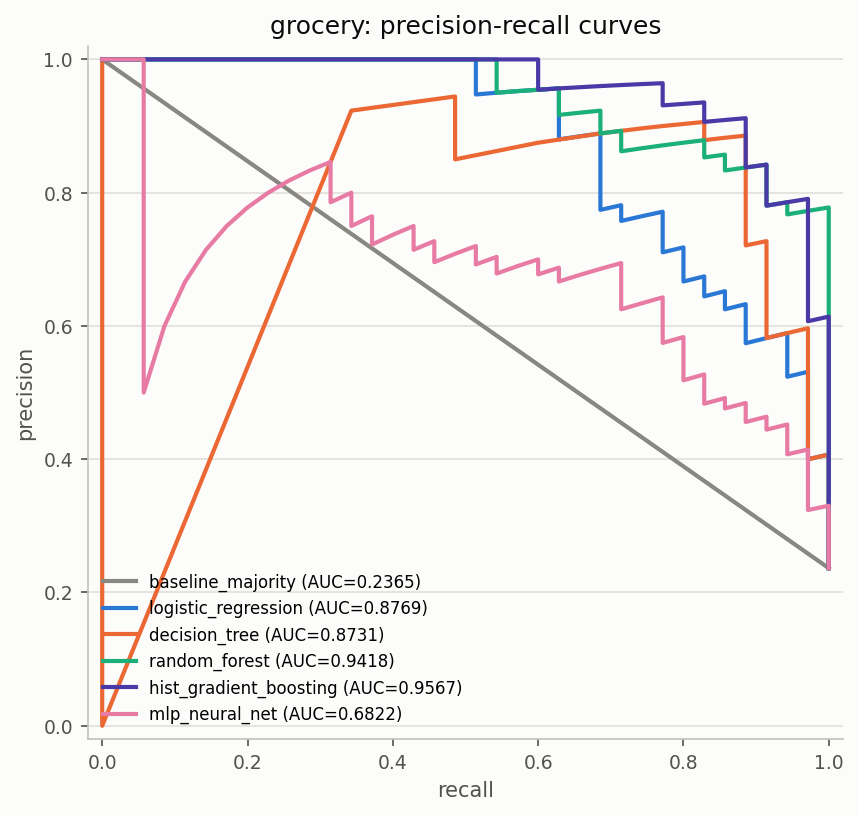
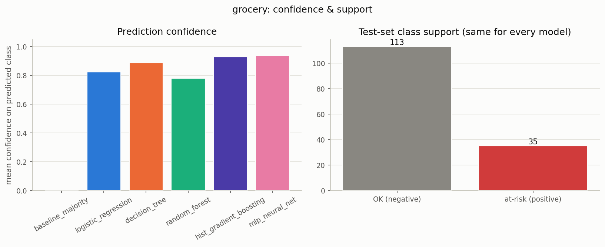
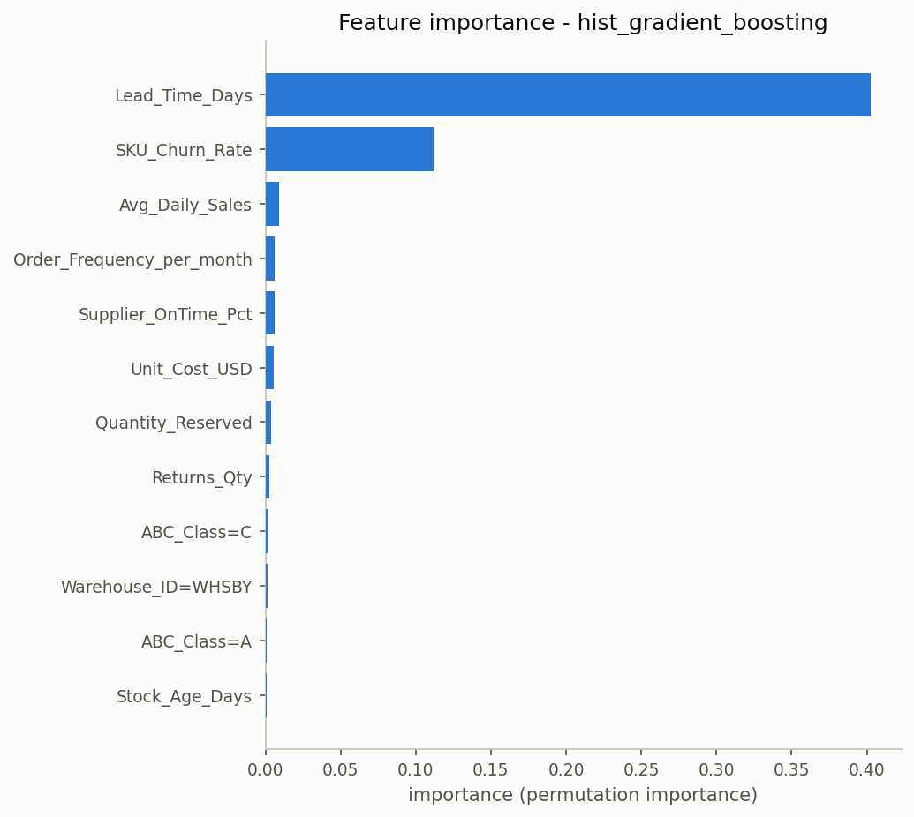
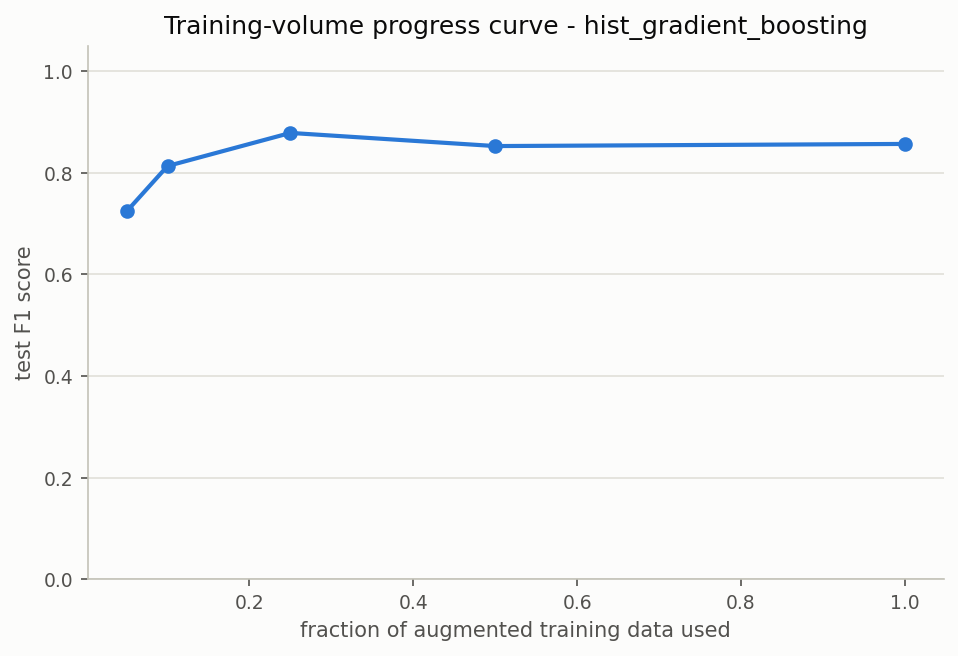
